# 🔗 ChainGo – A Blockchain Implementation in Go

<div align="center">


### 🚀 A Developer-Focused Blockchain Learning Framework Built with Go (Golang)

*Learn blockchain internals through hands-on implementation with Go concurrency, cryptography, and networking*

[Features](#-key-features) • [Getting Started](#️-getting-started) • [API Docs](#-api-endpoints) • [Roadmap](#-roadmap)

</div>

---

## 📘 Overview

**ChainGo** is a complete blockchain system implemented from scratch in **Golang**. It's designed as a **learning-grade blockchain framework** that demonstrates how real blockchains (like Bitcoin or Ethereum) work — while teaching core **Go concepts** such as **concurrency**, **goroutines**, **channels**, and **networking**.

Unlike most tutorials that just explain blockchain theory, ChainGo is **fully functional** — it exposes a REST API layer, wallet management, transaction handling, and concurrent mining using Proof-of-Work (PoW).

### 🎯 What Makes ChainGo Different?

- ✅ **Production-Ready Patterns**: Real-world Go concurrency patterns
- ✅ **Complete System**: Not just a blockchain, but wallets, mining, and networking
- ✅ **Educational**: Extensive comments and documentation throughout the codebase
- ✅ **P2P Networking**: Multi-node synchronization and blockchain consensus

---

## 🧭 Project Goals

| Goal | Description |
|------|-------------|
| 📚 **Educational** | Understand blockchain internals through practical Go programming |
| 🛠️ **Practical** | Build a functional blockchain capable of mining, transactions, and consensus |
| 📈 **Scalable** | Expand into a distributed multi-node network with persistence |
| 🔬 **Experimental** | Use as a base for experimenting with consensus algorithms and blockchain applications |

---

## 🧩 Key Features

### Backend (Go)
- 🧱 **Blockchain Core** - Custom implementation from scratch
- ⛏️ **Proof-of-Work** - Concurrent mining with goroutines
- 💳 **Wallet System** - ECDSA-based cryptography
- 💰 **Transactions** - Signed and verified transactions
- 🌐 **REST API** - Complete JSON API layer
- 🧵 **Concurrency** - Advanced goroutine patterns
- 💾 **Persistence** - BoltDB storage
- 🔄 **P2P Networking** - Multi-node synchronization

---

## 📁 Project Structure

```
ChainGo/
│
├── main.go                 # Application entry point
├── chaingo_backend         # Compiled executable
├── chaingo.db              # BoltDB database file
├── verify_chain.sh         # Automated test script
├── API_GUIDE.md            # Complete API documentation
├── PROJECT_EXPLAINED.md    # Detailed project explanation
│
├── blockchain/             # Core blockchain package
│   ├── block.go            # Block structure, serialization
│   ├── blockchain.go       # Chain management, validation
│   ├── pow.go              # Proof of Work algorithm
│   ├── transaction.go      # Transaction structure, signing
│   ├── wallet.go           # ECDSA wallet, key generation
│   └── utils.go            # Helper functions
│
├── internal/               # REST API layer
│   ├── server.go           # Fiber HTTP server setup
│   └── handlers.go         # Endpoint logic (16 API handlers)
│
├── network/                # P2P networking
│   ├── node.go             # Node implementation
│   ├── peer.go             # Peer management
│   └── protocol.go         # Network protocol
│
├── pkg/                    # Data persistence
│   └── bolt.go             # BoltDB implementation
│
├── go.mod                  # Go module dependencies
├── go.sum                  # Dependency checksums
└── README.md               # This file
```

---

## 🧠 How ChainGo Works

```mermaid
graph LR
    A[User Creates Wallet] --> B[Generate ECDSA Keys]
    B --> C[Create Transaction]
    C --> D[Sign with Private Key]
    D --> E[Add to Mempool]
    E --> F[Miner Starts Mining]
    F --> G[Run PoW Algorithm]
    G --> H[Find Valid Nonce]
    H --> I[Add Block to Chain]
    I --> J[Broadcast to Network]
    J --> K[Update UI Dashboard]
```



### Step-by-Step Flow

1. **🔐 Create a Wallet**
   - Generate ECDSA public/private key pair
   - Derive address from public key hash (Bitcoin-style)
   - Store wallet securely

2. **💸 Create a Transaction**
   - User signs transaction with private key
   - Transaction validated and added to mempool
   - Broadcasting to network nodes

3. **⛏️ Mine a Block**
   - Miner collects pending transactions from mempool
   - Runs Proof-of-Work using concurrent goroutines
   - Finds valid nonce satisfying difficulty target
   - Adds block to blockchain and clears mempool

4. **🔍 Query the Chain**
   - REST API provides blockchain data
   - Vue.js frontend displays real-time updates
   - Block explorer shows detailed transaction history

---

## ⚙️ API Endpoints

### Wallet Management
| Method | Endpoint | Description | Request Body |
|--------|----------|-------------|--------------|
| `POST` | `/api/wallet/create` | Create new wallet | - |
| `GET` | `/api/wallet/balance/:address` | Get wallet balance | - |
| `GET` | `/api/wallet/:address` | Get wallet details | - |

### Transactions
| Method | Endpoint | Description | Request Body |
|--------|----------|-------------|--------------|
| `POST` | `/api/transaction/create` | Create transaction | `{from, to, amount, privateKey}` |
| `GET` | `/api/transaction/pool` | View mempool | - |
| `GET` | `/api/transaction/:hash` | Get transaction | - |

### Mining
| Method | Endpoint | Description | Request Body |
|--------|----------|-------------|--------------|
| `POST` | `/api/mine/start` | Start mining | `{minerAddress}` |
| `POST` | `/api/mine/stop` | Stop mining | - |
| `GET` | `/api/mine/status` | Mining status | - |

### Blockchain
| Method | Endpoint | Description | Request Body |
|--------|----------|-------------|--------------|
| `GET` | `/api/blockchain` | Get full chain | - |
| `GET` | `/api/block/:hash` | Get block by hash | - |
| `GET` | `/api/block/height/:number` | Get block by height | - |

### Network (Optional)
| Method | Endpoint | Description | Request Body |
|--------|----------|-------------|--------------|
| `POST` | `/api/peers/add` | Add peer node | `{address, port}` |
| `GET` | `/api/peers` | List connected peers | - |
| `GET` | `/api/sync` | Sync with network | - |

### System
| Method | Endpoint | Description | Request Body |
|--------|----------|-------------|--------------|
| `GET` | `/api/status` | Node statistics | - |
| `GET` | `/api/health` | Health check | - |

---

## 🛠️ Getting Started

### Prerequisites

- **Go** 1.21 or higher
- **Git**

### Installation

#### 1️⃣ Clone Repository

```bash
git clone https://github.com/Vishal-2029/Chaingo.git
cd ChainGo
```

#### 2️⃣ Install Dependencies

```bash
go mod download
```

#### 3️⃣ Build the Application

```bash
go build -o chaingo_backend main.go
```

#### 4️⃣ Run the Blockchain Node

```bash
./Chaingo
```

The backend server will start on `http://localhost:8080` (API) and `:9000` (P2P)

You can customize ports:
```bash
./Chaingo -api 8080 -p2p 9000 -db chaingo.db
```

---

## 🎮 Usage Examples

For complete API documentation, see [API_GUIDE.md](API_GUIDE.md)

### Create a Wallet

```bash
curl -X POST http://localhost:8080/api/wallet/create
```

**Response:**
```json
{
  "address": "b358327f2d0cdcd524218fd109ef91b175af67caf73009ea4a0bf58ff85dbf0b",
  "publicKey": "04a8b2c3d4e5f6...",
  "privateKey": "ebc4d5e6f7g8h9...",
  "message": "Wallet created successfully - SAVE YOUR PRIVATE KEY!"
}
```

### Mine a Block

```bash
curl -X POST http://localhost:8080/api/mine \
  -H "Content-Type: application/json" \
  -d '{
    "minerAddress": "b358327f2d0cdcd524218fd109ef91b175af67caf73009ea4a0bf58ff85dbf0b"
  }'
```

### Create Transaction

```bash
curl -X POST http://localhost:8080/api/transaction/create \
  -H "Content-Type: application/json" \
  -d '{
    "from": "b358327f2d0cdcd524218fd109ef91b175af67caf73009ea4a0bf58ff85dbf0b",
    "to": "7bd72b6d716277445abaff98bbd77808b110264c958a8bba7ab6997fca01ad2a",
    "amount": 10,
    "privateKey": "your-private-key"
  }'
```


### View Blockchain

```bash
curl http://localhost:8080/api/chain
```

### Run Multi-Node Network

**Terminal 1 (Node 1):**
```bash
./Chaingo -api 8080 -p2p 9000 -db node1.db
```

**Terminal 2 (Node 2):**
```bash
./Chaingo -api 8081 -p2p 9001 -db node2.db
```

**Connect Nodes:**
```bash
curl -X POST http://localhost:8081/api/peer/add \
  -H "Content-Type: application/json" \
  -d '{"address": ":9000"}'

# Sync blockchain
curl http://localhost:8081/api/sync
```

---

## 🧠 Go Concepts Demonstrated

| Concept | Implementation | File |
|---------|----------------|------|
| **Structs & Methods** | Block, Blockchain, Transaction, Wallet | `blockchain/*.go` |
| **Interfaces** | Database abstraction, consensus | `storage/db.go` |
| **Goroutines** | Concurrent mining, API handlers | `blockchain/pow.go` |
| **Channels** | Mining result communication | `blockchain/pow.go` |
| **Mutex/RWMutex** | Thread-safe mempool access | `blockchain/blockchain.go` |
| **Context** | Mining cancellation, timeouts | `blockchain/pow.go` |
| **JSON Encoding** | API serialization | `api/handlers.go` |
| **File I/O** | Blockchain persistence | `storage/*.go` |
| **Crypto (ECDSA)** | Digital signatures | `blockchain/wallet.go` |
| **SHA256** | Block hashing | `blockchain/block.go` |
| **HTTP Server** | REST API | `api/server.go` |
| **Error Handling** | Idiomatic Go errors | Throughout |

---

## 📈 Roadmap

### ✅ Completed

- [x] Core blockchain structure
- [x] Proof-of-Work mining with block rewards
- [x] ECDSA wallet system
- [x] Transaction signing & verification
- [x] REST API implementation
- [x] BoltDB persistence layer
- [x] P2P network synchronization
- [x] Multi-node blockchain sync

### 🔮 Planned

- [ ] Improved consensus algorithms (Proof-of-Stake)
- [ ] Smart contract engine (Lua/WASM)
- [ ] CLI management tool
- [ ] Merkle tree implementation
- [ ] Block pruning optimization
- [ ] Light client support
- [ ] Docker orchestration
- [ ] Comprehensive test suite
- [ ] Performance benchmarks

---

## 🧪 Testing

Run the automated verification script:

```bash
chmod +x verify_chain.sh
./verify_chain.sh
```

This script tests:
- Wallet creation
- Mining with rewards
- Transaction creation and signing
- Balance calculations
- Multi-node P2P synchronization

Run individual tests:
```bash
go test ./... -v
go test ./... -cover
```

---

## 📊 Performance

- **Mining Speed**: ~1000-5000 hashes/sec (depends on difficulty)
- **Block Time**: Configurable (default: ~10 seconds)
- **Transaction Throughput**: ~100 tx/block
- **API Response Time**: <50ms average

---

## 🔐 Security Considerations

⚠️ **This is an educational project. Do not use in production without proper security audit.**

- Private keys stored in memory (use hardware wallets for production)
- Basic transaction validation (implement advanced checks)
- No Byzantine fault tolerance (single-node system)
- Simplified consensus (real blockchains are more complex)

---

## 🤝 Contributing

We love contributions! Here's how you can help:

1. 🍴 Fork the repository
2. 🌿 Create a feature branch: `git checkout -b feature/amazing-feature`
3. 💾 Commit changes: `git commit -m 'Add amazing feature'`
4. 🚀 Push to branch: `git push origin feature/amazing-feature`
5. 🎉 Open a Pull Request

### Development Guidelines

- Follow Go best practices and `gofmt`
- Write tests for new features
- Update documentation
- Keep commits atomic and descriptive
- Add comments for complex logic

---

## 📚 Learning Resources

- [Blockchain Basics](https://www.geeksforgeeks.org/software-engineering/blockchain/)
- [Go Concurrency Patterns](https://go.dev/talks/2012/concurrency.slide#1)
- [Cryptography in Blockchain](https://www.geeksforgeeks.org/computer-networks/cryptography-and-its-types/)
- [API Documentation](https://github.com/Vishal-2029/ChainGo/blob/main/API_GUIDE.md)

---

## 🧑‍💻 Author

**Vishal**  
Backend & Blockchain Developer  
📍 Specialized in Go + Blockchain + Distributed Systems

- 🌐 Website: [your-website.com]
- 💼 LinkedIn: [Vishal Sabhadiya](https://www.linkedin.com/in/vishal-sabhadiya-4916472a7/)
- 🐙 GitHub: [@Vishal-2029](https://github.com/Vishal-2029)
- 📧 Email: sabhadiyavishal02@gmail.com

---

## 🙏 Acknowledgments

- Inspired by Bitcoin and Ethereum
- Go community for excellent libraries
- Vue.js team for the amazing framework
- All contributors to this project

---

## 📄 License

This project is open-source and available under the **MIT License**.

```
MIT License

Copyright (c) 2024 Vish

Permission is hereby granted, free of charge, to any person obtaining a copy
of this software and associated documentation files (the "Software"), to deal
in the Software without restriction...
```

See [LICENSE](LICENSE) file for full details.

---

## 📞 Support

- 📖 [Documentation](docs/)
- 🐛 [Issue Tracker](https://github.com/yourusername/chaingo/issues)
- 💬 [Discussions](https://github.com/yourusername/chaingo/discussions)
- 📧 Email: support@chaingo.dev

---

<div align="center">

### ⭐ Star this repo if you find it helpful!

Made with ❤️ by developers, for developers

[⬆ Back to Top](#-chaingo--a-blockchain-implementation-in-go)

</div>
