# 🔗 ChainGo – A Blockchain Implementation in Go

<div align="center">


### 🚀 A Developer-Focused Blockchain Learning Framework Built with Go (Golang)

*Learn blockchain internals through hands-on implementation with Go concurrency, cryptography, and networking*

[Features](#-key-features) • [Getting Started](#️-getting-started) • [API Docs](#-api-endpoints) • [Roadmap](#-roadmap) • [Contributing](#-contributing)

</div>

---

## 📘 Overview

**ChainGo** is a complete blockchain system implemented from scratch in **Golang**, paired with a modern **Vue.js** frontend for visualization and interaction. It's designed as a **learning-grade blockchain framework** that demonstrates how real blockchains (like Bitcoin or Ethereum) work — while teaching core **Go concepts** such as **concurrency**, **goroutines**, **channels**, and **networking**.

Unlike most tutorials that just explain blockchain theory, ChainGo is **fully interactive** — it exposes a REST API layer, wallet management, transaction handling, and concurrent mining using Proof-of-Work (PoW).

### 🎯 What Makes ChainGo Different?

- ✅ **Production-Ready Patterns**: Real-world Go concurrency patterns
- ✅ **Interactive UI**: Vue.js dashboard for real-time blockchain visualization
- ✅ **Complete System**: Not just a blockchain, but wallets, mining, and networking
- ✅ **Educational**: Extensive comments and documentation throughout the codebase

---

## 🧭 Project Goals

| Goal | Description |
|------|-------------|
| 📚 **Educational** | Understand blockchain internals through practical Go programming |
| 🛠️ **Practical** | Build a functional blockchain capable of mining, transactions, and consensus |
| 📈 **Scalable** | Expand into a distributed multi-node network with persistence |
| 🔬 **Experimental** | Use as a base for experimenting with consensus algorithms and blockchain applications |

---

## 🧩 Key Features

<table>
<tr>
<td width="50%">

### Backend (Go)
- 🧱 **Blockchain Core** - Custom implementation from scratch
- ⛏️ **Proof-of-Work** - Concurrent mining with goroutines
- 💳 **Wallet System** - ECDSA-based cryptography
- 💰 **Transactions** - Signed and verified transactions
- 🌐 **REST API** - Complete JSON API layer
- 🧵 **Concurrency** - Advanced goroutine patterns
- 💾 **Persistence** - BoltDB/LevelDB storage
- 🔄 **P2P Networking** - Multi-node synchronization

</td>
<td width="50%">

### Frontend (Vue.js)
- 📊 **Live Dashboard** - Real-time blockchain visualization
- 💼 **Wallet Manager** - Create and manage wallets
- 💸 **Transaction UI** - Send transactions with ease
- ⛏️ **Mining Console** - Start/stop mining operations
- 🔍 **Block Explorer** - Detailed block and transaction viewer
- 📈 **Network Stats** - Node status and peer information
- 🎨 **Modern UI** - Responsive design with Tailwind CSS
- ⚡ **Real-time Updates** - WebSocket integration (optional)

</td>
</tr>
</table>

---

## 📁 Project Structure

```
chaingo/
│
├── backend/                    # Go Backend
│   ├── main.go                # Application entry point
│   │
│   ├── blockchain/            # Core blockchain package
│   │   ├── block.go          # Block structure, hashing, serialization
│   │   ├── blockchain.go     # Blockchain logic, chain management
│   │   ├── pow.go            # Proof of Work mining implementation
│   │   ├── transaction.go    # Transaction creation and validation
│   │   └── wallet.go         # ECDSA wallet and key management
│   │
│   ├── api/                   # REST API layer
│   │   ├── server.go         # HTTP server setup
│   │   ├── handlers.go       # API endpoint handlers
│   │   └── middleware.go     # CORS, logging, auth
│   │
│   ├── network/               # P2P networking (optional)
│   │   ├── node.go           # Node implementation
│   │   ├── peer.go           # Peer management
│   │   └── protocol.go       # Network protocol
│   │
│   ├── storage/               # Data persistence
│   │   ├── db.go             # Database interface
│   │   └── bolt.go           # BoltDB implementation
│   │
│   ├── utils/                 # Utility functions
│   │   ├── crypto.go         # Cryptographic helpers
│   │   └── logger.go         # Logging utilities
│   │
│   └── config/                # Configuration
│       └── config.go         # App configuration
│
├── frontend/                   # Vue.js Frontend
│   ├── public/                # Static assets
│   ├── src/
│   │   ├── assets/           # Images, styles
│   │   ├── components/       # Vue components
│   │   │   ├── Blockchain.vue
│   │   │   ├── Wallet.vue
│   │   │   ├── Mining.vue
│   │   │   ├── Transactions.vue
│   │   │   └── BlockExplorer.vue
│   │   │
│   │   ├── views/            # Page views
│   │   ├── router/           # Vue Router config
│   │   ├── store/            # Vuex/Pinia state
│   │   ├── services/         # API service layer
│   │   │   └── api.js        # API client
│   │   ├── App.vue           # Root component
│   │   └── main.js           # Vue app entry
│   │
│   ├── package.json
│   └── vite.config.js        # Vite configuration
│
├── docs/                      # Documentation
│   ├── API.md                # API documentation
│   ├── ARCHITECTURE.md       # System architecture
│   └── MINING.md             # Mining guide
│
├── scripts/                   # Utility scripts
│   └── setup.sh              # Setup script
│
├── .gitignore
├── README.md
└── LICENSE
```

---

## 🧠 How ChainGo Works

```mermaid
graph LR
    A[User Creates Wallet] --> B[Generate ECDSA Keys]
    B --> C[Create Transaction]
    C --> D[Sign with Private Key]
    D --> E[Add to Mempool]
    E --> F[Miner Starts Mining]
    F --> G[Run PoW Algorithm]
    G --> H[Find Valid Nonce]
    H --> I[Add Block to Chain]
    I --> J[Broadcast to Network]
    J --> K[Update UI Dashboard]
```



### Step-by-Step Flow

1. **🔐 Create a Wallet**
   - Generate ECDSA public/private key pair
   - Derive address from public key hash (Bitcoin-style)
   - Store wallet securely

2. **💸 Create a Transaction**
   - User signs transaction with private key
   - Transaction validated and added to mempool
   - Broadcasting to network nodes

3. **⛏️ Mine a Block**
   - Miner collects pending transactions from mempool
   - Runs Proof-of-Work using concurrent goroutines
   - Finds valid nonce satisfying difficulty target
   - Adds block to blockchain and clears mempool

4. **🔍 Query the Chain**
   - REST API provides blockchain data
   - Vue.js frontend displays real-time updates
   - Block explorer shows detailed transaction history

---

## ⚙️ API Endpoints

### Wallet Management
| Method | Endpoint | Description | Request Body |
|--------|----------|-------------|--------------|
| `POST` | `/api/wallet/create` | Create new wallet | - |
| `GET` | `/api/wallet/balance/:address` | Get wallet balance | - |
| `GET` | `/api/wallet/:address` | Get wallet details | - |

### Transactions
| Method | Endpoint | Description | Request Body |
|--------|----------|-------------|--------------|
| `POST` | `/api/transaction/create` | Create transaction | `{from, to, amount, privateKey}` |
| `GET` | `/api/transaction/pool` | View mempool | - |
| `GET` | `/api/transaction/:hash` | Get transaction | - |

### Mining
| Method | Endpoint | Description | Request Body |
|--------|----------|-------------|--------------|
| `POST` | `/api/mine/start` | Start mining | `{minerAddress}` |
| `POST` | `/api/mine/stop` | Stop mining | - |
| `GET` | `/api/mine/status` | Mining status | - |

### Blockchain
| Method | Endpoint | Description | Request Body |
|--------|----------|-------------|--------------|
| `GET` | `/api/blockchain` | Get full chain | - |
| `GET` | `/api/block/:hash` | Get block by hash | - |
| `GET` | `/api/block/height/:number` | Get block by height | - |

### Network (Optional)
| Method | Endpoint | Description | Request Body |
|--------|----------|-------------|--------------|
| `POST` | `/api/peers/add` | Add peer node | `{address, port}` |
| `GET` | `/api/peers` | List connected peers | - |
| `GET` | `/api/sync` | Sync with network | - |

### System
| Method | Endpoint | Description | Request Body |
|--------|----------|-------------|--------------|
| `GET` | `/api/status` | Node statistics | - |
| `GET` | `/api/health` | Health check | - |

---

## 🛠️ Getting Started

### Prerequisites

- **Go** 1.21 or higher
- **Node.js** 18+ and npm/yarn
- **Git**

### Installation

#### 1️⃣ Clone Repository

```bash
git clone https://github.com/yourusername/chaingo.git
cd chaingo
```

#### 2️⃣ Setup Backend

```bash
cd backend

# Install dependencies
go mod download

# Run the blockchain node
go run main.go
```

The backend server will start on `http://localhost:8080`

#### 3️⃣ Setup Frontend

```bash
cd frontend

# Install dependencies
npm install

# Start development server
npm run dev
```

The Vue.js frontend will start on `http://localhost:5173`

### 🐳 Docker Setup (Optional)

```bash
# Build and run with Docker Compose
docker-compose up -d

# View logs
docker-compose logs -f
```

---

## 🎮 Usage Examples

### Create a Wallet

```bash
curl -X POST http://localhost:8080/api/wallet/create
```

**Response:**
```json
{
  "address": "1A1zP1eP5QGefi2DMPTfTL5SLmv7DivfNa",
  "publicKey": "04a8b2c3d4e5f6...",
  "privateKey": "ebc4d5e6f7g8h9..."
}
```

### Create Transaction

```bash
curl -X POST http://localhost:8080/api/transaction/create \
  -H "Content-Type: application/json" \
  -d '{
    "from": "1A1zP1eP5QGefi2DMPTfTL5SLmv7DivfNa",
    "to": "1BvBMSEYstWetqTFn5Au4m4GFg7xJaNVN2",
    "amount": 50,
    "privateKey": "your-private-key"
  }'
```

### Start Mining

```bash
curl -X POST http://localhost:8080/api/mine/start \
  -H "Content-Type: application/json" \
  -d '{
    "minerAddress": "1A1zP1eP5QGefi2DMPTfTL5SLmv7DivfNa"
  }'
```

### View Blockchain

```bash
curl http://localhost:8080/api/blockchain
```

---

## 🧠 Go Concepts Demonstrated

| Concept | Implementation | File |
|---------|----------------|------|
| **Structs & Methods** | Block, Blockchain, Transaction, Wallet | `blockchain/*.go` |
| **Interfaces** | Database abstraction, consensus | `storage/db.go` |
| **Goroutines** | Concurrent mining, API handlers | `blockchain/pow.go` |
| **Channels** | Mining result communication | `blockchain/pow.go` |
| **Mutex/RWMutex** | Thread-safe mempool access | `blockchain/blockchain.go` |
| **Context** | Mining cancellation, timeouts | `blockchain/pow.go` |
| **JSON Encoding** | API serialization | `api/handlers.go` |
| **File I/O** | Blockchain persistence | `storage/*.go` |
| **Crypto (ECDSA)** | Digital signatures | `blockchain/wallet.go` |
| **SHA256** | Block hashing | `blockchain/block.go` |
| **HTTP Server** | REST API | `api/server.go` |
| **Error Handling** | Idiomatic Go errors | Throughout |

---

## 📈 Roadmap

### ✅ Completed

- [x] Core blockchain structure
- [x] Proof-of-Work mining
- [x] ECDSA wallet system
- [x] Transaction signing & verification
- [x] REST API implementation
- [x] Vue.js frontend dashboard

### 🚧 In Progress

- [ ] BoltDB persistence layer
- [ ] P2P network synchronization
- [ ] WebSocket real-time updates

### 🔮 Planned

- [ ] Proof-of-Stake consensus (alternative)
- [ ] Smart contract engine (Lua/WASM)
- [ ] CLI management tool
- [ ] Mobile app (React Native)
- [ ] Block pruning optimization
- [ ] Merkle tree implementation
- [ ] Light client support
- [ ] Docker orchestration
- [ ] Comprehensive test suite
- [ ] Performance benchmarks

---

## 🧪 Testing

```bash
# Run backend tests
cd backend
go test ./... -v

# Run with coverage
go test ./... -cover

# Frontend tests
cd frontend
npm run test
```

---

## 📊 Performance

- **Mining Speed**: ~1000-5000 hashes/sec (depends on difficulty)
- **Block Time**: Configurable (default: ~10 seconds)
- **Transaction Throughput**: ~100 tx/block
- **API Response Time**: <50ms average

---

## 🔐 Security Considerations

⚠️ **This is an educational project. Do not use in production without proper security audit.**

- Private keys stored in memory (use hardware wallets for production)
- Basic transaction validation (implement advanced checks)
- No Byzantine fault tolerance (single-node system)
- Simplified consensus (real blockchains are more complex)

---

## 🤝 Contributing

We love contributions! Here's how you can help:

1. 🍴 Fork the repository
2. 🌿 Create a feature branch: `git checkout -b feature/amazing-feature`
3. 💾 Commit changes: `git commit -m 'Add amazing feature'`
4. 🚀 Push to branch: `git push origin feature/amazing-feature`
5. 🎉 Open a Pull Request

### Development Guidelines

- Follow Go best practices and `gofmt`
- Write tests for new features
- Update documentation
- Keep commits atomic and descriptive
- Add comments for complex logic

---

## 📚 Learning Resources

- [Blockchain Basics](docs/BLOCKCHAIN_BASICS.md)
- [Go Concurrency Patterns](docs/CONCURRENCY.md)
- [Cryptography in Blockchain](docs/CRYPTOGRAPHY.md)
- [API Documentation](docs/API.md)

---

## 🌟 Showcase

### Dashboard Preview
*[Add screenshot of Vue.js dashboard]*

### Mining in Action
*[Add GIF of mining process]*

### Block Explorer
*[Add screenshot of block explorer]*

---

## 🧑‍💻 Author

**Vish**  
Backend & Blockchain Developer  
📍 Specialized in Go + Blockchain + Distributed Systems

- 🌐 Website: [your-website.com]
- 💼 LinkedIn: [your-linkedin]
- 🐙 GitHub: [@yourusername](https://github.com/yourusername)
- 📧 Email: your.email@example.com

---

## 🙏 Acknowledgments

- Inspired by Bitcoin and Ethereum
- Go community for excellent libraries
- Vue.js team for the amazing framework
- All contributors to this project

---

## 📄 License

This project is open-source and available under the **MIT License**.

```
MIT License

Copyright (c) 2024 Vish

Permission is hereby granted, free of charge, to any person obtaining a copy
of this software and associated documentation files (the "Software"), to deal
in the Software without restriction...
```

See [LICENSE](LICENSE) file for full details.

---

## 📞 Support

- 📖 [Documentation](docs/)
- 🐛 [Issue Tracker](https://github.com/yourusername/chaingo/issues)
- 💬 [Discussions](https://github.com/yourusername/chaingo/discussions)
- 📧 Email: support@chaingo.dev

---

<div align="center">

### ⭐ Star this repo if you find it helpful!

Made with ❤️ by developers, for developers

[⬆ Back to Top](#-chaingo--a-blockchain-implementation-in-go)

</div>
